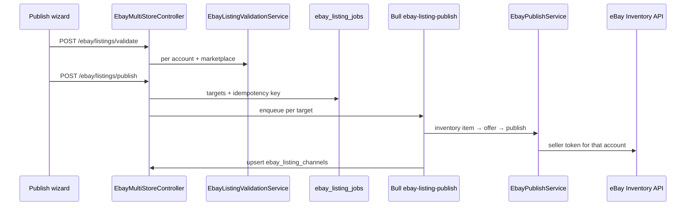

# eBay multi-store — developer handoff

This document answers architecture questions, maps the spec to this repo, and explains how to run and extend the feature end-to-end.

## Executive summary (business logic)

- **RealTrackApp owns one eBay Developer application** (`EBAY_CLIENT_ID`, `EBAY_CLIENT_SECRET`, RuName / `EBAY_REDIRECT_URI`).
- **Each seller connects with “Sign in with eBay”** (OAuth 2.0 authorization code grant). They do **not** need their own Developer Program app for normal use.
- **Each connected seller gets their own encrypted OAuth token pair** in `ebay_oauth_tokens`, scoped to `organization_id` + `ebay_user_id`.
- **Every API call** that touches seller data uses **that seller’s user access token**, never another store’s token.
- **One internal catalog SKU** can be published to **many eBay stores**; each store has separate offer ID, listing ID, policies, marketplace, and row in `ebay_listing_channels`.
- **Policies and locations are per seller and per marketplace** — never copied from Store A to Store B.

Sellers only need a separate Developer account if you hit **enterprise/compliance**, need **isolated rate limits**, or build a **white-label** product where each tenant runs their own eBay app.

---

## Architecture Q&A

### 1. Does each connected store need separate eBay Developer API access?

**No.** One Developer Program application serves all sellers. eBay issues **per-seller user tokens** after each seller grants consent. Rate limits and app identity are tied to **your** app keyset; seller identity is in the token.

### 2. Are our existing Developer credentials enough?

**Yes**, provided:

- Production and Sandbox keysets match the environment you connect (`environment` on `connected_ebay_accounts`).
- `EBAY_REDIRECT_URI` exactly matches the RuName redirect URL registered in the [eBay Developer Portal](https://developer.ebay.com/my/auth).
- Requested scopes are enabled on the keyset (see below).

### 3. Do sellers only sign in with eBay and grant OAuth consent?

**Yes** for standard operation:

1. User clicks **Connect with eBay**.
2. Browser goes to `auth.ebay.com` / `auth.sandbox.ebay.com` consent.
3. Callback hits `GET /api/integrations/ebay/oauth/callback`.
4. Backend exchanges `code` → access + refresh tokens, calls Identity API, persists account.

No seller-supplied Client ID/Secret unless you deliberately support BYO-credentials (not implemented).

### 4. OAuth scopes (recommended set)

Configure `EBAY_SCOPES` (space-separated) or use defaults in `EbayAccountTokenService.getDefaultScopes()`:

| Capability | Scope URL |
|------------|-----------|
| Base / generic API access | `https://api.ebay.com/oauth/api_scope` |
| Seller identity (username / user id) | `https://api.ebay.com/oauth/api_scope/commerce.identity.readonly` |
| Inventory read | `https://api.ebay.com/oauth/api_scope/sell.inventory.readonly` |
| Inventory write (items, offers, publish) | `https://api.ebay.com/oauth/api_scope/sell.inventory` |
| Business policies read | `https://api.ebay.com/oauth/api_scope/sell.account.readonly` |
| Business policies write (if creating policies in-app) | `https://api.ebay.com/oauth/api_scope/sell.account` |
| Orders read (future) | `https://api.ebay.com/oauth/api_scope/sell.fulfillment.readonly` |
| Orders write (future) | `https://api.ebay.com/oauth/api_scope/sell.fulfillment` |
| Marketing (optional promos) | `https://api.ebay.com/oauth/api_scope/sell.marketing` |

**API mapping:**

- **Identity** → `GET /commerce/identity/v1/user/` after connect.
- **Inventory** → `/sell/inventory/v1/*` (items, offers, publish, locations).
- **Account** → `/sell/account/v1/*_policy`, privileges, programs.
- **Fulfillment** → `/sell/fulfillment/v1/*` when order sync ships.

Validate granted scopes in `ebay_oauth_tokens.granted_scopes` before publish; block if `sell.inventory` or policy read scopes missing.

### 5. Token storage, refresh, revoke, audit

| Concern | Implementation |
|---------|----------------|
| Storage | `ebay_oauth_tokens`: AES-256-GCM via `TokenEncryptionService`; mirror in `channel_connections.encrypted_tokens` for legacy `EbayInventoryApiService` |
| Refresh | `EbayAccountTokenService.getValidAccessToken()`; Redis lock `ebay-token-refresh:{accountId}`; updates `last_token_refresh_at` |
| Expiry | Short-lived access token; refresh before API calls when near expiry |
| Revoke / disconnect | `POST .../disconnect` → `connection_status = disabled`, `revoked_at` on token row |
| Re-auth | `POST .../reconnect` → new OAuth start; seller must consent again |
| Failure | Refresh failure → `reconnect_required`, `last_error_message`, no silent fallback |
| Audit | `listing_action_logs` (connect, sync, publish); `ebay_api_audit_logs` (HTTP metadata, no secrets) |

**Never** return tokens to the frontend or log authorization codes / refresh tokens.

### 6. Preventing cross-store data mixing

1. **Tenant key:** `organization_id` on all integration tables; assert membership on every route.
2. **Account key:** `ebay_account_id` on policies, channels, jobs; resolve token only after `WHERE id = :id AND organization_id = :org`.
3. **Uniqueness:** `(organization_id, ebay_user_id)` on `connected_ebay_accounts`; `(catalog_product_id, ebay_account_id, marketplace_id)` on `ebay_listing_channels`.
4. **Token isolation:** One token row per `connected_ebay_accounts.id`; publish worker loads account → `primary_store_id` → token for that store only.
5. **Policy isolation:** `ebay_business_policies` keyed by `ebay_account_id` + `marketplace_id` + `policy_type` + `ebay_policy_id`.
6. **No shared SKU assumptions:** Same internal SKU may map to different `ebay_inventory_sku` per store via overrides.

---

## Spec → schema mapping

| Spec name | This repo |
|-----------|-----------|
| `ebay_connected_accounts` | `connected_ebay_accounts` |
| `ebay_oauth_tokens` | `ebay_oauth_tokens` |
| `ebay_marketplaces` | `ebay_account_marketplaces` + `EbayMarketplaceConfigService` (US, GB, DE, AU, Motors) |
| `ebay_seller_policies` | `ebay_business_policies` |
| `ebay_inventory_locations` | Cached as `policy_type = 'location'` in `ebay_business_policies` |
| `ebay_store_listings` | `ebay_listing_channels` |
| `ebay_listing_sync_logs` | `ebay_listing_sync_logs` (migration `1775300000000`) |
| `ebay_publish_jobs` | `ebay_listing_jobs` + `ebay_listing_job_targets` |
| `ebay_api_audit_logs` | `ebay_api_audit_logs` (migration `1775300000000`) |

---

## Service layer

| Spec service | Implementation |
|--------------|----------------|
| `EbayOAuthService` | `EbayIntegrationsOAuthService` + `EbayOAuthStateStore` + `EbayAccountTokenService` |
| `EbayAccountService` | `EbayIntegrationAccountService` + `EbayPolicySyncService` + `EbaySellAccountApiService` |
| `EbayInventoryService` | `EbayInventoryApiService` (channels) |
| `EbayListingPublisherService` | `EbayMultiStoreListingService` + `ListingBuilderService` + `EbayPublishService` |
| `EbaySyncService` | `EbaySyncService` + `EbayInventorySyncProcessor` |
| `EbayApiClient` | `EbayInventoryApiService` / `EbaySellAccountApiService` + `EbayApiAuditService` (wrap further calls with audit as needed) |

---

## HTTP API (prefix `/api`)

### OAuth & accounts

- `POST /integrations/ebay/oauth/start` — `{ marketplaceId, environment, accountDisplayName? }` (+ optional `organizationId` for multi-workspace users) → `{ authUrl, state }`. **Sellers never paste an eBay org ID** — identity is from OAuth + `GET commerce/identity/v1/user/` (`userId` preferred over `username`).
- `GET /integrations/ebay/workspace` — resolves the signed-in user’s RealTrack workspace (internal tenant).
- `GET /integrations/ebay/oauth/callback` — browser only; redirects to frontend
- `GET /integrations/ebay/accounts?organizationId=`
- `GET /integrations/ebay/accounts/:id?organizationId=`
- `POST /integrations/ebay/accounts/:id/disconnect`
- `POST /integrations/ebay/accounts/:id/reconnect`
- `POST /integrations/ebay/accounts/:id/sync-policies`
- `POST /integrations/ebay/accounts/:id/sync-listings` — queues Bull job
- `POST /integrations/ebay/accounts/:id/sync-orders` — queues Bull `ebay-order-sync` job
- `GET /integrations/ebay/accounts/:id/sync-logs`
- `GET /integrations/ebay/accounts/:id/api-audit`
- `GET/PATCH .../policies`, `.../default-policies`

### Multi-store publish

- `POST /ebay/listings/validate`
- `POST /ebay/listings/publish`
- `GET /ebay/listing-jobs/:id`, `.../targets`
- `GET /ebay/listings`, `/ebay/errors`, `/ebay/activity-logs`

Auth: **JWT Bearer** on all integration routes (`JwtAuthGuard` on `EbayIntegrationsModule`). Only `GET /integrations/ebay/oauth/callback` is `@Public()`. Frontend uses `fetchWithAuth` + `useEbayWorkspace()` — **no manual Organization ID field**. `organizationId` is RealTrack’s internal tenant boundary; it is created on register or first eBay page load, not supplied by eBay.

---

## Frontend

| Page | Path |
|------|------|
| eBay connections dashboard | `/settings/integrations/ebay` — `EbayStoresSettingsPage` |
| Store detail | `/settings/integrations/ebay/:accountId` — `EbayStoreDetailPage` |
| Policy mapping | `/settings/integrations/ebay/:accountId/policies` |
| Catalog multi-publish | `/catalog/products/:productId/publish/ebay` — `EbayPublishWizardPage` |

Legacy RuName may still hit `/channels/ebay/callback` in the SPA; that page **redirects** to `GET /api/integrations/ebay/oauth/callback`. `GET /api/channels/ebay/auth-url` returns **400** with migration hints. Settings → Channels **Connect via OAuth** for eBay calls `POST /integrations/ebay/oauth/start` (requires org id from eBay stores page).

---

## Publish flow (catalog → N stores)



Validation blocks: inactive account, missing policies/location, invalid Motors fitment, bad category/aspects, duplicate publish unless update intent.

OpenAI (`EbayComplianceService`, listing generation) is **assistive only** — always run deterministic validation after AI output.

---

## Background jobs

| Queue | Processor | Status |
|-------|-----------|--------|
| `ebay-listing-publish` | `EbayListingPublishProcessor` | Implemented |
| `ebay-inventory-sync` | `EbayInventorySyncProcessor` | Implemented |
| `ebay-policy-sync` | — | Sync is synchronous in controller |
| `ebay-order-sync` | — | Planned (`EbayOrderImportService` exists) |
| `ebay-listing-revision` / `ending` | — | Planned |

Run workers: Redis + BullMQ with same `BULLMQ_PREFIX` as backend.

---

## Migrations

1. `1775200000000-EbayMultiAccountIntegration.ts` — core multi-account schema  
2. `1775300000000-EbayMultiStoreExtensions.ts` — audit/sync logs, account stats, uniqueness  

```bash
cd backend && npm run migration:run
```

---

## Environment variables

See `backend/.env.example`:

- `EBAY_CLIENT_ID`, `EBAY_CLIENT_SECRET`, `EBAY_DEV_ID`
- `EBAY_ENVIRONMENT` or per-connect `environment`
- `EBAY_REDIRECT_URI` → must be `https://<host>/api/integrations/ebay/oauth/callback`
- `EBAY_SCOPES` (optional override)
- `TOKEN_ENCRYPTION_KEY` (64-char hex) — **required in production**
- `FRONTEND_BASE_URL`, `REDIS_URL`, `EBAY_INTEGRATIONS_REDIS` (optional)

Set `CHANNEL_DEMO_MODE=false` in production so publish hits real eBay APIs.

---

## Sandbox testing

1. Create Sandbox keyset + test seller in Developer Portal.  
2. Set `environment: sandbox` on OAuth start.  
3. Connect store → sync policies → map defaults → validate + publish one catalog SKU on `EBAY_US` or `EBAY_MOTORS_US`.  
4. Confirm rows in `ebay_listing_channels` with `offer_id` / `listing_id`.  
5. Run **Sync listings** to refresh channel state from Inventory API.

---

## Production readiness checklist

- [ ] `TOKEN_ENCRYPTION_KEY` set; no dev scrypt fallback  
- [x] JWT auth on integration routes (`ebay-integrations` module guard)
- [x] Order sync worker (`ebay-order-sync` queue + `POST .../sync-orders`)
- [x] Legacy channels eBay OAuth unified into integrations callback  
- [ ] `CHANNEL_DEMO_MODE=false`  
- [ ] Single OAuth path (integrations callback only) documented for users  
- [ ] `EBAY_REDIRECT_URI` matches RuName in prod  
- [ ] Scopes on prod keyset include inventory + account + identity  
- [ ] Bull workers running for publish + inventory sync  
- [ ] Org-scoped catalog ownership (today `catalog_products.organization_id` may be null on import)  
- [ ] Rate-limit backoff on workers  
- [ ] Monitoring on `connection_status = reconnect_required`  
- [ ] Webhook signature verification for inventory/order updates (legacy webhook exists)  

---

## Error handling (user-visible)

| Situation | Behavior |
|-----------|----------|
| User denies consent | Redirect `?error=oauth_failed` |
| Invalid/expired OAuth state | 400; no token write |
| Missing scopes | Block publish; show reconnect |
| Refresh token invalid | `reconnect_required`; clear message |
| No business policies | Block publish; link to policy sync |
| Motors fitment missing | Validation error per target |
| Multi-store partial failure | Per-target status in job targets UI |

---

## Related docs

- `docs/ebay-multi-store-architecture.md` — internal architecture  
- `docs/ebay-api-integration-notes.md` — API/scopes notes  
- `docs/ebay-client-onboarding.md` — client-facing steps  

---

## Quick reference: who needs a Developer account?

| Role | Needs eBay Developer app? |
|------|---------------------------|
| RealTrackApp (you) | **Yes** — one app for all sellers |
| Each eBay seller using your product | **No** — OAuth sign-in only |
| Enterprise tenant with own compliance | Optional separate app per tenant |

This is the intended production model for RealTrackApp multi-store listing management.
